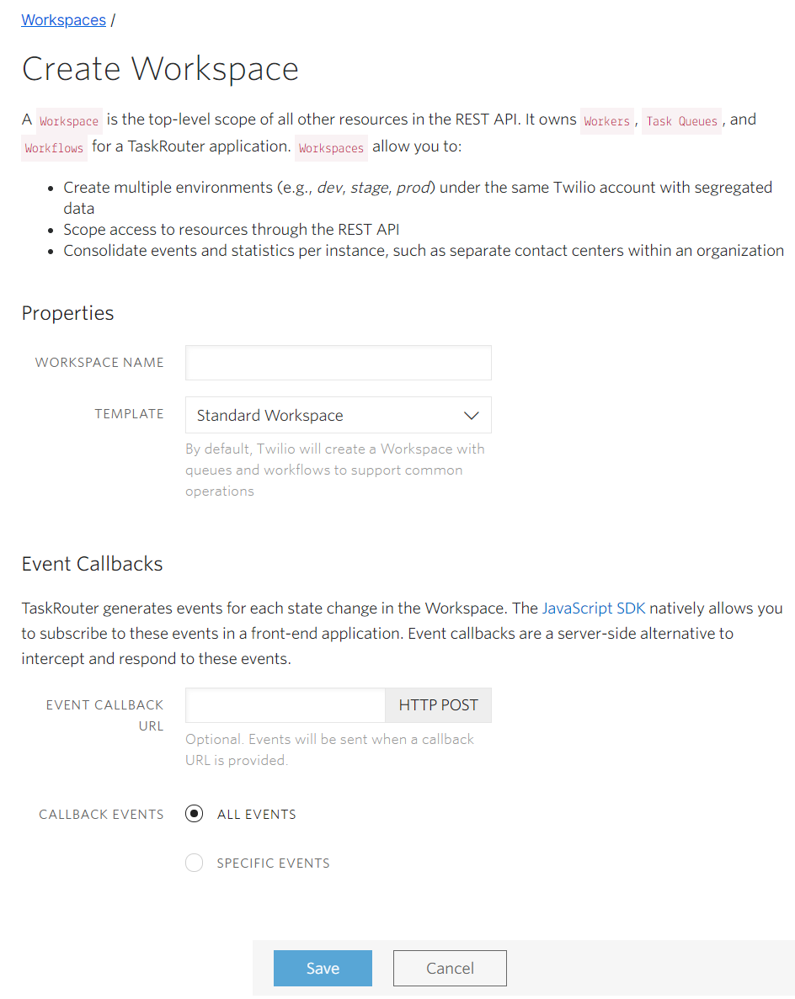

# Setting up a TaskRouter Workspace: Create a Workspace

A Workspace is the container element for any TaskRouter application.

Every element of a TaskRouter Workspace (including the Workspace itself) can be created using the REST API or the [TaskRouter console](https://www.twilio.com/console/taskrouter/dashboard). For simplicity, in this tutorial we will use the portal.

[Create a Workspace](https://www.twilio.com/console/taskrouter/workspaces) and give it a name (as below). For the template, choose 'Standard Workspace'. Leave the Event Callback URL blank:

That was easy! For the rest of Part 1, we'll be adding necessary elements to our new Workspace so we can start routing Tasks in Part 2.

- [Next: Add and configure workers»](workspace.md)
- [Part 1](part1.md)
- [Overview](../overview.md)
