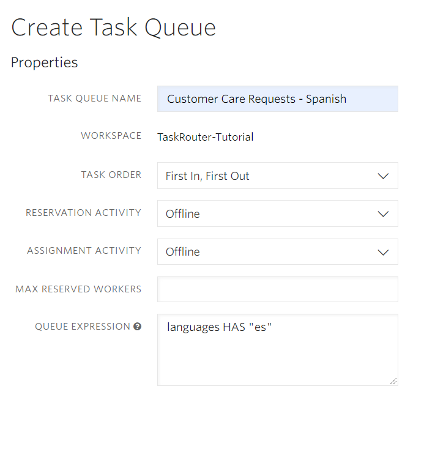

# Setting up a TaskRouter Workspace: Add and Configure TaskQueues

TaskQueues assign Tasks to Workers based on Worker attributes. For our example, we will use two TaskQueues - one for requests in Spanish and one for requests in English.

With your Workspace open in the [TaskRouter console](https://www.twilio.com/console/taskrouter/workspaces), click 'TaskQueues' then 'Create TaskQueue'.

## TaskQueue #1 - Spanish

Our first TaskQueue will target Workers like Alice who possess Spanish language skills.

Target Workers are described using an SQL-like syntax which matches the JSON attributes of Workers. Use the <code style="color:red;background-color:lightgrey">HAS</code> operator to check whether a Worker's languages array includes the value "es":

**Target Workers Expression** <code style="color:red;background-color:lightgrey">languages HAS "es"</code>

## TaskQueue #2 - English

To complete our example of language-based routing, create a second TaskQueue, this time targeting Workers like both Alice and Bob who possess English language skills:

**Target Workers Expression** <code style="color:red;background-color:lightgrey">languages HAS "en"</code>

[!taskqueue english](images/create_task_queue_english.png)

## Validating TaskQueue Filters

Reopen the 'Customer Care Requests - English' TaskQueue and scroll to the bottom of the page. You should see that both Alice and Bob are eligible to receive tasks from this TaskQueue:

[!matching english](images/matching_worker_english.png)

Reopen the Spanish TaskQueue for comparison - only Alice will show in the list of matching Workers:

[!matching spanish](images/matching_worker_spanish.png)

Wonderful. We have created two TaskQueues to target our Workers. But before a TaskQueue assigns a Task to a Worker, the Task needs to be created and added to the TaskQueue. That's the role of a Workflow.

[Next: Add a workflow](part1-d-add-workflow.md)

Click to expand navigation

- [Part 1](part1.md)
- [Overview](../overview.md)

