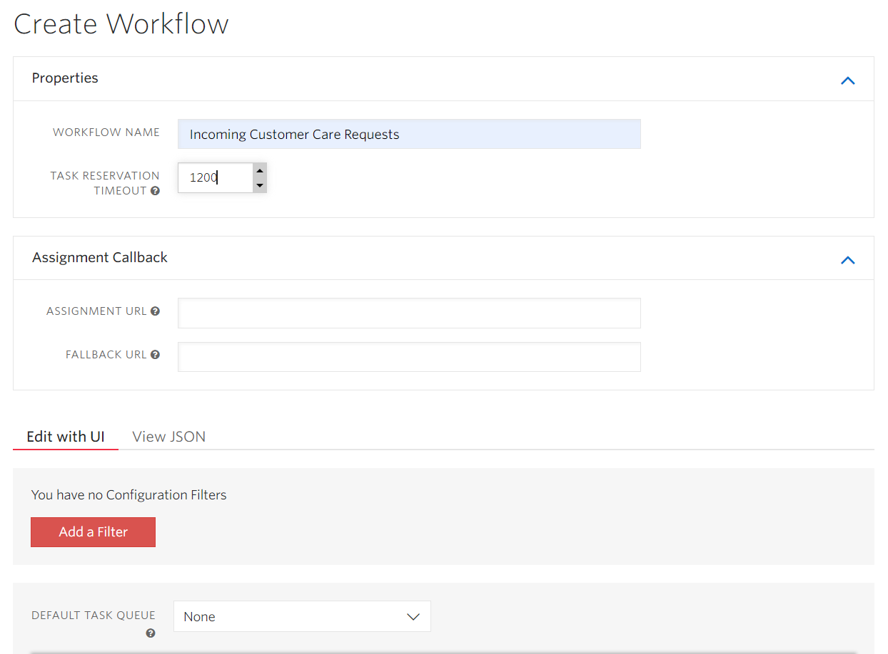
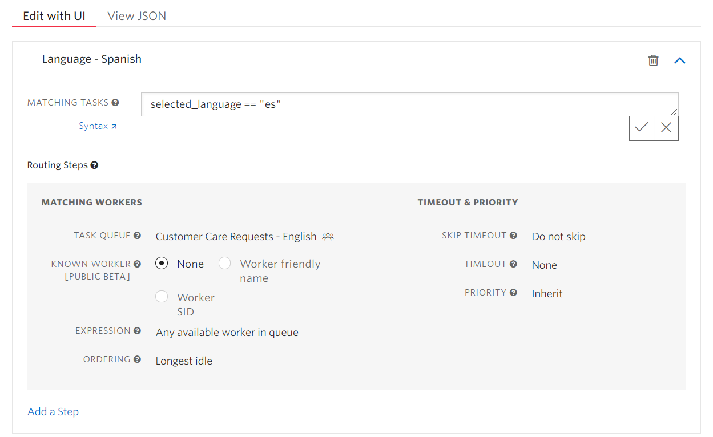
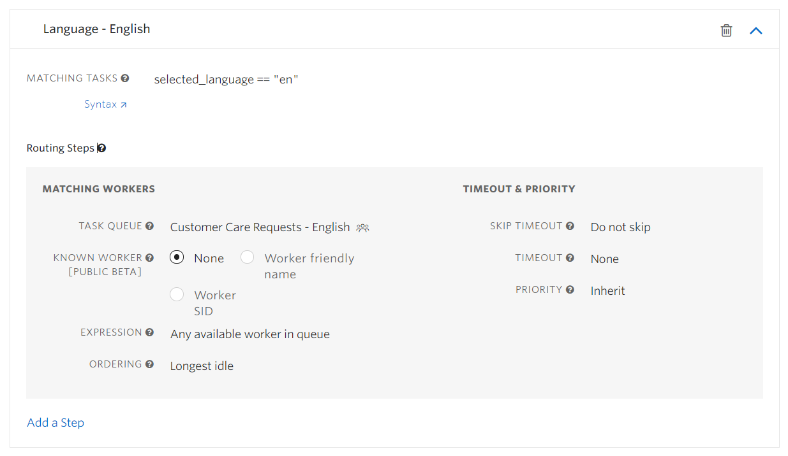
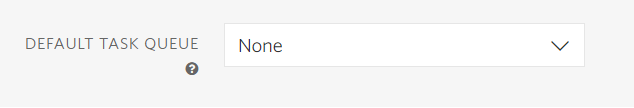

# Add and Configure a Workflow

With your Workspace open in the [TaskRouter web portal](https://www.twilio.com/user/account/taskrouter/workspaces), click 'Workflows' then 'Create Workflow'. Name the new Workflow 'Incoming Customer Care Requests'.

Every time you add a Task to TaskRouter, you will associate it with a Workflow. A Workflow examines the attributes of each incoming Task and adds it to the appropriate Task Queue. It also controls timeouts and escalations between TaskQueues - a concept not addressed in this Quickstart tutorial.

To make things easier for ourselves in Part 2, set a high value for "Task Reservation Timeout" - e.g. 1200 seconds. We'll be accepting Reservations manually, and having them time out would be frustrating. Leave "Assignment URL" blank for now. We'll come back to it later.

In Part 3, we'll use keypresses to capture a phone caller's language preference and use that information to route to the best Worker. To do that, we'll need a Task attribute to represent the caller's language selection. We can name Task attributes whatever we want, but it seems reasonable to use "selected_language".

Add two Routing Configuration filters to the Workflow. These will route new Tasks into the Task Queues we created earlier based on the value of "selected_language".

## Routing Configuration #1

The first Routing Configuration targets Tasks where the caller selected Spanish. It adds incoming Tasks to the 'Spanish' Task Queue.

Routing Configuration Expression: <code style="color:red;background-color:lightgrey">selected_langauge == "es"</code>

## Routing Configuration #2

Use the 'Add a filter' link to add your second Workflow filter.

Routing Configuration Expression: <code style="color:red;background-color:lightgrey">selected_language == "en"</code>

Set the default Task Queue to 'None' before saving the Workflow:

We're just about done setting up! But before we start adding Tasks to our Workspace, we need to understand the role of Activities.

[Next: Understanding Activities »](part1-e-understanding-activities.md)

Click to expand navigation

- [Part 1](part1.md)
- [Overview](../overview.md)

