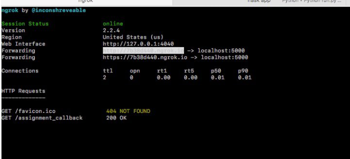

# Creating Tasks and Accepting Reservations: Set up the Assignment Callback URL

The basic lifecycle of a [successful] TaskRouter Task is as follows:

_Task Created → eligible Worker becomes available → Worker reserved → Reservation accepted → Task assigned to Worker._

In this part of the tutorial, we'll create Tasks and observe them through each of these stages. We start by creating a Task using the Tasks REST API. First time around we accept the Task using the Reservations REST API, then we create another Task and accept it using assignment callback instructions.

> Both the Reservations REST API and assignment callback instructions are valid methods for accepting a Reservation; it's likely that you'll choose one or the other based on the amount of background work that must be performed by your server before it accepts or rejects a Reservation. For example, due to the amount of time required, if you were to build a user interface that allowed human agents to inspect a Task before accepting it, you would need to accept the Reservation asynchronously using the Reservations REST API.

Finally time to write some (albeit minimalist!) code.

First set up the local Node/Express server:

Create your directory and initialize node.js

'''
npm init node
'''

There will be a series of questions.
package name:(name): taskrouter-quickstart
version: {enter}

"entry point:" type in "server.js"

This will create your package.json file.

'''
{
"name": "taskrouter-quickstart",
"version": "1.0.0",
"main": "server.js",
"directories": {
"test": "test"
},
"scripts": {
"test": "echo \"Error: no test specified\" && exit 1"
},
"author": "",
"license": "ISC",
"description": ""
}
'''

> Not sure if I need this section or go into setting start script.

Next we will need to install the express and twilio
'''
npm install --save express twilio dotenv
'''

### create .env file

'''
TWILIO_ACCOUNT_SID = "AC2##################..."
TWILIO_AUTH_TOKEN = "########..."
TWILIO_WORKSPACE_SID = "WS#####..."
TWILIO_WORKFLOW_SID = "WW#######..."
TWILIO_WORKER_ALICE_SID = "WK####..."
TWILIO_WORKER_BOB_SID = "WK####..."
TWILIO_POST_WORKER_ACTIVITY = "WA############..."
'''
It is best practice to keep your sid information into a .env file seprate from your server file. If you choose to add your project to git, ensure that you exclude your .env file in .gitignore

Do not worry about the TWILIO_POSTER_WORKER_ACTIVITY blank for now and we will address it later in the tutorial.

### server.js

```javascript
//imports
require("dotenv").config();
const express = require("express");
const { urlencoded } = require("body-parser");
const twilio = require("twilio");

//express setup
const port = 3000;
const app = express();
app.use(urlencoded({ extended: false }));

//account information

//routes
app.post("/assignment_callback", (req, res) => {
  try {
    console.log("assignment_callback");
    res.status(200).json({ message: "success" });
  } catch (err) {
    console.log(err);
    res.status(500).json({ message: "error", error: err });
  }
});
//initalize server
app.listen(port, () =>
  console.log(`Taskrouter app listening on port ${port}!`)
);
```

This returns a JSON document to TaskRouter with a 200 (OK) response code with the value "{m}essage:success}". This tells TaskRouter that the assignment callback was successfully received and parsed, but that we don't want to take any action on the Reservation right now. Instead, it's implied that we will use the REST API to accept or reject the Reservation when we are ready.

Now lets start our server

'''
node server.js
'''

Open up Postman (or equivelent utility) to test our route.
_because this is a post, you cannot directly hit it through your browser_

[postman-callback](images/postman_assignment_callback.png)

To allow Twilio to interact with your development server, we can use ngrok. After installing ngrok to your $PATH, run the following command at your terminal to start listening for requests from the outside world:

```
ngrok http 3000
```



Your local Node/Express server is now accessible to anyone (including TWilio servers) at your ngrok URL.

**PLACE IMAGE**

If you prefer not to expose your development machine to the Internet, deploy the Node/Express application to an Internet-accessible Web server.

With those things working, edit your "Incoming Customer Care Requests" Workflow to point at the newly implemented Assignment Callback URL

Excellent. We're ready to create Tasks and accept Reservations.

[Next: Create a Task using the REST API »](part2-a-create-task-restapi.md)

1. [Part 2 Overview](part2.md)
1. [Overview](../overview.md)
