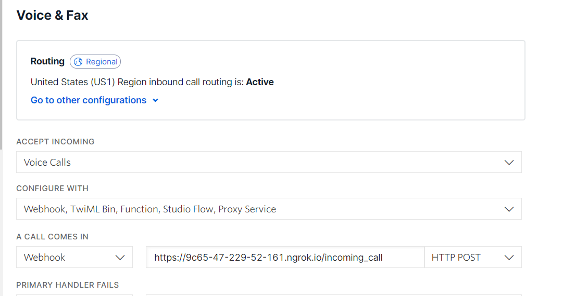

# Create Tasks from Phone Calls using TwiML: Receive an Incoming Call

We've seen how to create Tasks using the TaskRouter REST API and how to accept a Task Reservation using both the REST API and Assignment Callback instructions. TaskRouter also introduces new TwiML instructions that you can use to create a Task from a Twilio phone call.

To receive an incoming phone call, we first need a Twilio phone number. In this example we'll use a US toll-free number, but you can use a Voice capable number from any country.

Before purchasing or setting up the phone number, we need to add on to our run.py to handle incoming calls:

server.js

```javascript
//imports
require("dotenv").config();
const express = require("express");
const { urlencoded } = require("body-parser");
const twilio = require("twilio");
const VoiceResponse = require("twilio/lib/twiml/VoiceResponse");

//account information
const account_sid = process.env.TWILIO_ACCOUNT_SID;
const auth_token = process.env.TWILIO_AUTH_TOKEN;
const workspace_sid = process.env.TWILIO_WORKSPACE_SID;
const workflow_sid = process.env.TWILIO_WORKFLOW_SID;
const worker_alice_sid = process.env.TWILIO_WORKER_ALICE_SID;
const worker_bob_sid = process.env.TWILIO_WORKER_BOB_SID;
const post_worker_activity_sid = process.env.TWILIO_POST_WORKER_ACTIVITY;

//twilio setup
const client = twilio(account_sid, auth_token);
const voice_client = twilio.twiml.VoiceResponse();
//express setup
const port = 3000;
const app = express();
app.use(urlencoded({ extended: false }));

//routes
app.post("/assignment_callback", (req, res) => {
  try {
    console.log("assignment_callback");
    res.status(200).json({
      instruction: "accept",
    });
  } catch (err) {
    console.log(err);
    res.status(500).json({ message: "error", error: err });
  }
});

app.get("/create_task", (req, res) => {
  //Create a task
  try {
    client.taskrouter
      .workspaces(workspace_sid)
      .tasks.create({
        workflowSid: workflow_sid,
        attributes: JSON.stringify({
          selected_language: "es",
        }),
      })
      .then((task) => {
        console.log(task.sid);
        res.send(`task ${task.sid}`);
      });
  } catch (err) {
    console.log(err);
    res.status(500).json({ message: "error", error: err });
  }
});

app.get("/accept_reservation", (req, res) => {
  //accept reservation
  //ensure your url matches http://localhost:3000/accept_reservation?task_sid={task_sid}

  let task_sid = req.query.task_sid;
  let reservation_sid = req.query.reservation_sid;
  console.log("task", task_sid);
  console.log("reservation", reservation_sid);
  try {
    let reservation = client.taskrouter
      .workspaces(workspace_sid)
      .tasks(task_sid)
      .reservations(reservation_sid)
      .update({ reservationStatus: "accepted" })
      .then((reservation) => {
        console.log("reservation!", reservation.reservationStatus);
        res.status(200).json({
          reservation_status: reservation.reservationStatus,
          reservation_worker: reservation.workerName,
        });
      });
  } catch (err) {
    console.log(err);
    res.status(500).json({ message: "error", error: err });
  }
});
//incomming call
app.post("/incoming_call", (req, res) => {
  try {
    const twiml = new VoiceResponse();
    twiml.say("Welcome to the Call");
    //
    const g = twiml.gather({
      method: "POST",
      numDigits: 1,
      action: "/enqueue_call",
      timeout: 50,
    });
    g.say("For English press 1", { language: "en" });
    g.say("Para español presione 2", { language: "es" });
    //send to Twilio as twiml
    res.status(200).send(twiml.toString());
  } catch (err) {
    console.log(err);
    res.status(500).json({ message: "error" });
  }
});
//initalize server
app.listen(port, () =>
  console.log(`Taskrouter app listening on port ${port}!`)
);
```

You can use the [Buy Numbers](https://www.twilio.com/console/phone-numbers/search) section of the Twilio Voice and Messaging web portal to purchase a new phone number, or use an existing Twilio phone number. Open the phone number details page and point the Voice Request URL at your new endpoint:



Using any phone, call the Twilio number. You will be prompted to press one for Spanish or two for English. However, when you press a digit, you'll hear an error message. That's because our <code style="color:red;background-color:ivory"><_Gather_></code> verb is pointing to another endpoint, <code style="color:red;background-color:ivory">enqueue_call</code>, which we haven't implemented yet. In the next step we'll add the required endpoint and use it to create a new Task based on the language selected by the caller.

[Next: Create a Task using Enqueue »](part3_b_enqueue.md)
