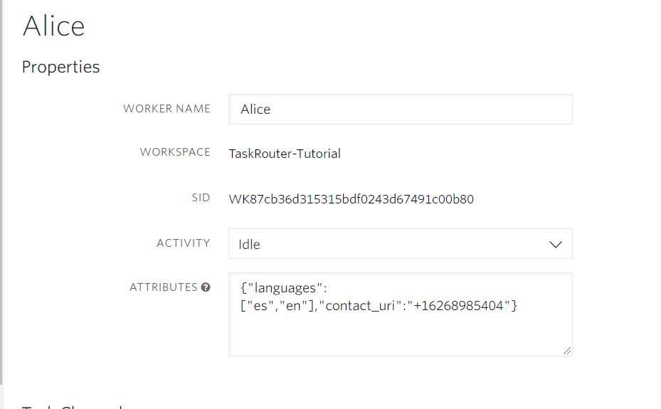

# Create Tasks from Phone Calls using TwiML: Dequeue a Call to a Worker

In the previous step we created a Task from an incoming phone call using <code style="color:red;background_color:ivory"><\_Enqueue workflowSid="WW0123401234.."\_></code>. In this step we will create another call and dequeue it to an eligible Worker when one becomes available.

Back in [Part 1](../part1/part1.md) of the Quickstart we created a Worker named Alice that is capable of handling both English and Spanish inquiries. With your Workspace open in the [TaskRouter web portal](https://www.twilio.com/console/taskrouter/workspaces), click 'Workers' and click to edit the details of our Worker Alice. Ensure that Alice is set to a non-available Activity state such as 'Offline'. Next, edit Alice's JSON attributes and add a "contact_uri" field. When Alice accepts a Task, she will receive a call on the phone number entered in the "contact_uri" field. Replace the dummy 555 number below with your own phone number.

Alice's modified JSON attributes:

```json
{ "languages": ["en", "es"], "contact_uri": "+15555555555" }
```

Or, as displayed in the web portal:


In this step, we again use <code style="color:red;background-color:ivory"><_Enqueue_></code> to create a Task from an incoming phone call. When an eligible Worker (in this case Alice) becomes available, TaskRouter will make a request to our Assignment Callback URL. This time, we will respond with a special 'dequeue' [instruction](https://www.twilio.com/docs/taskrouter/handle-assignment-callbacks); this tells Twilio to call Alice at her 'contact_uri' and bridge to the caller.

_For this part of the Quickstart, although not totally necessary it will be useful to have two phones available - one to call your Twilio number, and one to receive a call as Alice. Experienced Twilio users might consider using Twilio Client as one of the endpoints._

With your Workspace open in the [TaskRouter web portal](https://www.twilio.com/console/taskrouter/workspaces), click 'Activities' and then 'Create Activity'. Give the new Activity a name of 'WrapUp' and a value of 'unavailable'. Once you've saved it, make a note of the Activity Sid:~~~

**NOTE IMAGE / REACTED**

To return the 'dequeue' assignment instruction, modify server.js assignment_callback endpoint to now issue a dequeue instruction, substituting your new WrapUp ActivitySid between the curly braces:

### server.js

```javascript
//imports
require("dotenv").config();
const express = require("express");
const { urlencoded } = require("body-parser");
const twilio = require("twilio");
const VoiceResponse = require("twilio/lib/twiml/VoiceResponse");

//account information
const account_sid = process.env.TWILIO_ACCOUNT_SID;
const auth_token = process.env.TWILIO_AUTH_TOKEN;
const workspace_sid = process.env.TWILIO_WORKSPACE_SID;
const workflow_sid = process.env.TWILIO_WORKFLOW_SID;
const worker_alice_sid = process.env.TWILIO_WORKER_ALICE_SID;

//twilio setup
const client = twilio(account_sid, auth_token);
const voice_client = twilio.twiml.VoiceResponse();
//express setup
const port = 3000;
const app = express();
app.use(urlencoded({ extended: false }));

//routes
//
app.post("/assignment_callback", (req, res) => {
  //accsessed via twilio
  //console.log(req.body);
  // console.log('assignmeegnt post callback');
  // res.status(200).json({ "instruction": "accept", "activity_sid": post_worker_activity_sid, "channelId": worker_neva_sid });
  console.log("assignment_callback");
  try {
    res.status(200).json({
      instruction: "dequeue",
      from: "+16267901016",
    });
  } catch (err) {
    console.log(err);
    res.status(500).json({ message: "error" });
  }
});

app.get("/create_task", (req, res) => {
  //Create a task
  try {
    client.taskrouter
      .workspaces(workspace_sid)
      .tasks.create({
        workflowSid: workflow_sid,
        attributes: JSON.stringify({
          selected_language: "es",
        }),
      })
      .then((task) => {
        console.log(task.sid);
        res.send(`task ${task.sid}`);
      });
  } catch (err) {
    console.log(err);
    res.status(500).json({ message: "error", error: err });
  }
});

app.get("/accept_reservation", (req, res) => {
  //accept reservation
  //ensure your url matches http://localhost:3000/accept_reservation?task_sid={task_sid}

  let task_sid = req.query.task_sid;
  let reservation_sid = req.query.reservation_sid;
  console.log("task", task_sid);
  console.log("reservation", reservation_sid);
  try {
    let reservation = client.taskrouter
      .workspaces(workspace_sid)
      .tasks(task_sid)
      .reservations(reservation_sid)
      .update({ reservationStatus: "accepted" })
      .then((reservation) => {
        console.log("reservation!", reservation.reservationStatus);
        res.status(200).json({
          reservation_status: reservation.reservationStatus,
          reservation_worker: reservation.workerName,
        });
      });
  } catch (err) {
    console.log(err);
    res.status(500).json({ message: "error", error: err });
  }
});
//incomming call
app.post("/incoming_call", (req, res) => {
  try {
    const twiml = new VoiceResponse();
    twiml.say("Welcome to the Call");
    //
    const g = twiml.gather({
      method: "POST",
      numDigits: 1,
      action: "/enqueue_call",
      timeout: 50,
    });
    twiml.say(
      {
        voice: "alice",
      },
      "Welcome to the Call"
    );
    //
    const g = twiml.gather({
      method: "POST",
      numDigits: 1,
      action: "/enqueue_call",
      timeout: 50,
    });
    g.say(
      {
        voice: "alice",
        language: "en-US",
      },
      "For English press 1",
      { language: "en" }
    );
    g.say(
      {
        voice: "alice",
        language: "es-MX",
      },
      "Para español presione 2",
      { language: "es" }
    );
    //send to Twilio as twiml
    res.status(200).send(twiml.toString());
  } catch (err) {
    console.log(err);
    res.status(500).json({ message: "error" });
  }
});
app.post("/enqueue_call", (req, res) => {
  const digit_pressed = req.body.Digits;
  try {
    const language = (digits) => (digits === "1" ? "en" : "es");
    const twiml = new VoiceResponse();
    const enqueue = twiml.enqueue({
      workflowSid: workflow_sid,
    });
    enqueue.task(`{"selected_language":"${language(digit_pressed)}"}`);
    res.setHeader("Content-Type", "text/xml");
    res.status(200).send(enqueue.toString());
  } catch (err) {
    console.log(err);
    res.status(500).send(err);
  }
});
//initalize server
app.listen(port, () =>
  console.log(`Taskrouter app listening on port ${port}!`)
);
```

This returns a very simple JSON object from the Assignment Callback URL:

## JSON Output

```json
{ "instruction": "dequeue", "from": "+15556667777" }
```

The JSON instructs Twilio to dequeue the waiting call and, because we don't include an explicit "to" field in our JSON, connect it to our Worker at their "contact_uri". This is convenient default behavior provided by TaskRouter.

In the next step, we test our incoming call flow from end-to-end.

[Next: End-to-End Phone Call Task Assignment »](part3_d_end_to_end.md)
