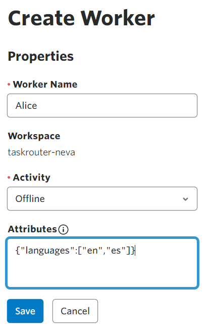
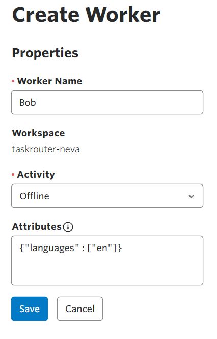

# Setting up a TaskRouter Workspace: Add and Configure Workers

Workers represent the people or processes that perform Tasks. In our example, Workers represent human agents handling incoming voice calls. We plan to intelligently route calls by matching the language skills of our Workers to the language requirements of incoming callers. Specifically, both of our Workers will be capable of handling requests in English, but only one in Spanish.

With your Workspace open in the [TaskRouter console](https://www.twilio.com/console/taskrouter/workspaces), click 'Workers' then 'Create Worker'.

## Worker #1

Our first Worker, Alice, will be capable of both English and Spanish language Tasks.

Worker attributes are described using JSON. Add a "languages" field to Alice's Attributes object and set its value to an array as below.

**Alice's Worker Attributes Expression:** <code style="color:red;background-color:lightgrey">{"languages": ["en","es"]}</code>

## Worker #2

Rinse and repeat. Create another Worker named Bob who is exclusively capable of handling Tasks in English.

Bob's Worker Attributes Expression: <code style="color:red;background-color:lightgrey">{"languages": ["en"]}</code>

[Next: Add Task Queues >>](part1-c-create-task_queues.md)

Click to expand navigation

- [Part 1](part1.md)
- [Overview](../overview.md)

