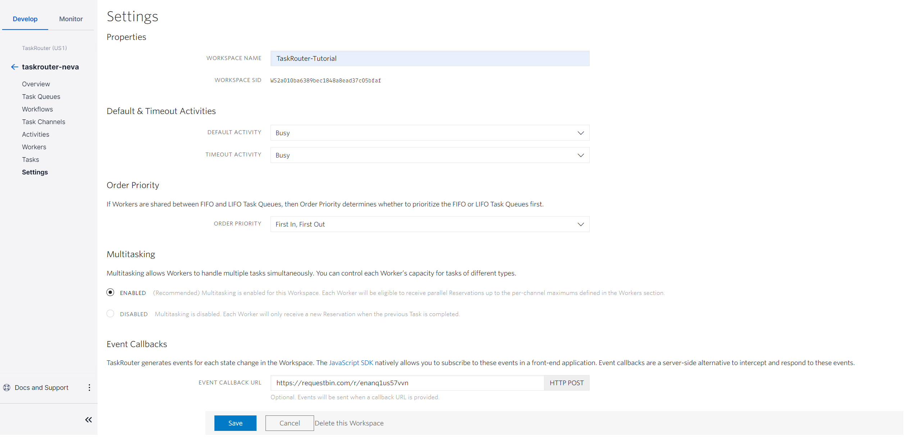
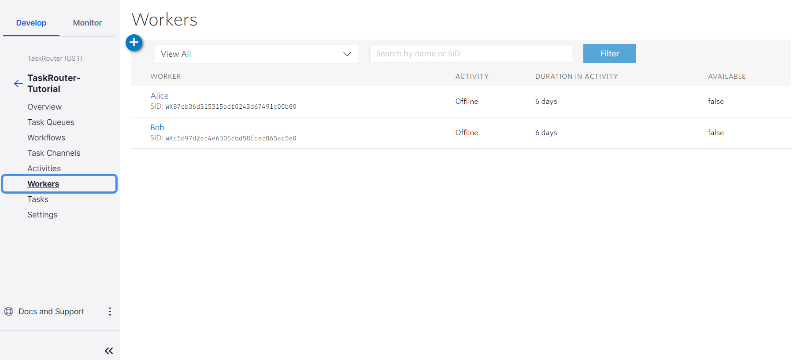
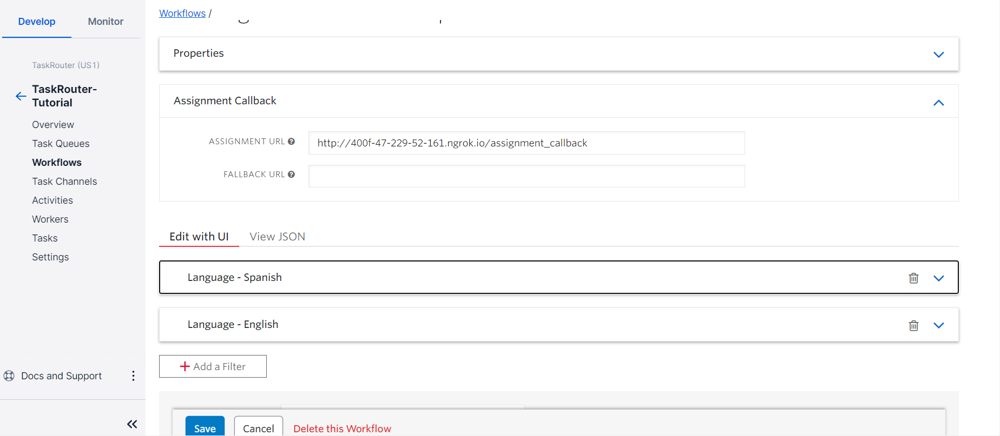
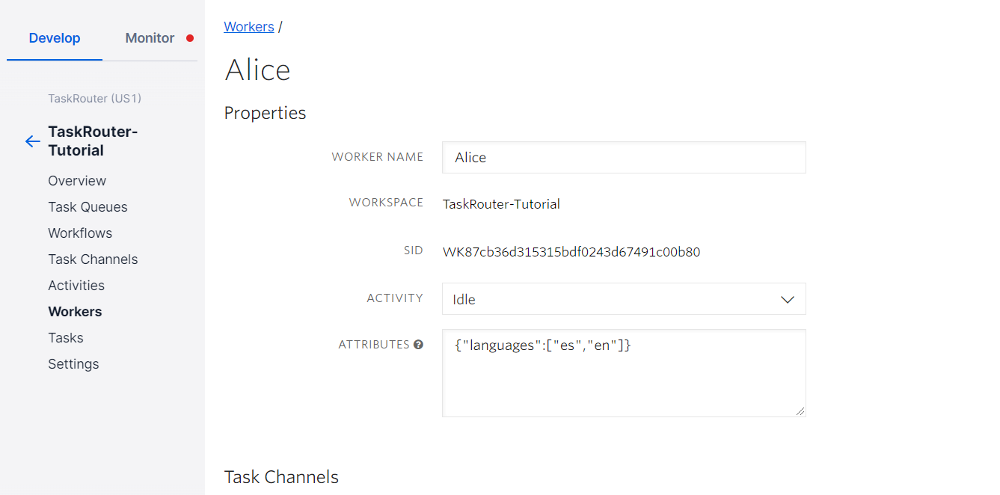
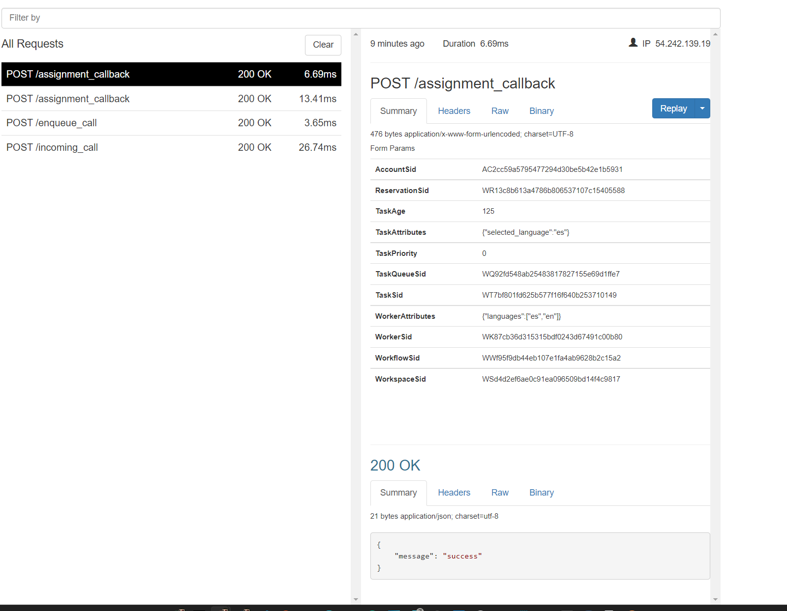

# Creating Tasks and Accepting Reservations: Create a Task using the REST API

Recall the TaskRouter Task lifecycle:

_Task Created → eligible Worker becomes available → Worker reserved → Reservation accepted → Task assigned to Worker._

> If you'd like to to view the events happening in your Workspace at an Event Callback URL, please obtain a [free endpoint URL](https://requestbin.com/) then set the Event Callback URL in your Workspace to point there.



Before we create our first Task, make sure that our Worker Alice is in a non-available Activity state. Bob's Activity state won't matter right now, as we will create a Spanish language Task that he is not eligible to handle.

With your Workspace open in the [TaskRouter web portal](https://www.twilio.com/user/account/taskrouter/workspaces), click 'Workers' then click to edit Alice and set her Activity to 'Offline'. Your Workers should look like this:



To simulate reality, we'll create a Task using the REST API rather than the web portal. We'll add on to our run.py to create a task with our web server. Replace the {} with your Twilio AccountSid, Twilio AuthToken, WorkspaceSid, and WorkflowSid.

\*note if you did not already install the Twilio NPM, do it now before executing this code.

```javascript
//imports
require("dotenv").config();
const express = require("express");
const { urlencoded } = require("body-parser");
const twilio = require("twilio");

//express setup
const port = 3000;
const app = express();
app.use(urlencoded({ extended: false }));

//twilio setup
const client = twilio(account_sid, auth_token);

//account information
const account_sid = process.env.TWILIO_ACCOUNT_SID;
const auth_token = process.env.TWILIO_AUTH_TOKEN;
const workspace_sid = process.env.TWILIO_WORKSPACE_SID;
const workflow_sid = process.env.TWILIO_WORKFLOW_SID;
const worker_neva_sid = process.env.TWILIO_WORKER_NEVA_SID;
const worker_zoe_sid = process.env.TWILIO_WORKER_ZOE_SID;
const post_worker_activity_sid = process.env.TWILIO_POST_WORKER_ACTIVITY;
//routes
app.post("/assignment_callback", (req, res) => {
  try {
    console.log("assignment_callback");
    res.status(200).json({ message: "success" });
  } catch (err) {
    console.log(err);
    res.status(500).json({ message: "error", error: err });
  }
});

app.get("/create_task", (req, res) => {
  //Create a task
  client.taskrouter
    .workspaces(workspace_sid)
    .tasks.create({
      workflowSid: workflow_sid,
      attributes: JSON.stringify({
        selected_language: "es",
      }),
    })
    .then((task) => {
      console.log(task.sid);
      res.send(`task ${task.sid}`);
    });
});

//initalize server
app.listen(port, () =>
  console.log(`Taskrouter app listening on port ${port}!`)
);
```

Next, reset your Workflow's Assignment Callback URL as shown below to point to your new, running Node/Express server's path.



To generate a Task, visit the /create_task route we have just defined.

Alternatively, we can also create a Task using the command line utility curl, which should exist on any Mac or Linux workstation. Execute the following command at your terminal, making sure to replace the {} with your ngrok forwarding URL:

```bash
curl -X POST https://taskrouter.twilio.com/v1/Workspaces/{WorkspaceSid}/Tasks
--data-urlencode Attributes='{"selected_language": "es"}'
-d WorkflowSid={WorkflowSid}
-u {AccountSid}:{AuthToken}
```

If you don't have curl, you can run this request using an HTTP test tool or using the Task creation dialog in the TaskRouter web portal: with your Workspace open, click 'Tasks' then 'Create Task'.

To see our newly created Task in the TaskRouter web portal, with your Workspace open, click 'Tasks' in the main navigation. Notice that the Task has been added to the "Customer Care Requests - Spanish" Task Queue based on the Attributes we provided in the curl request. The Assignment Status is 'pending' because there is no available Worker that matches the Task Queue.


#Make an Eligible Worker Available

Look again at the TaskRouter Task lifecycle:

_Task Created → eligible Worker becomes available → Worker reserved → Reservation accepted → Task assigned to Worker._

The first stage – 'Task Created' – is complete. To trigger an automatic Task Reservation, the next step is to bring an eligible Worker online.

Therefore, with your Workspace open in the TaskRouter web portal, click 'Workers', then click to edit Alice and set her Activity to 'Idle':



When you hit save, Twilio will create a Reservation between Alice and our Task and you will receive a Webhook request at the Assignment Callback URL that we set up in the previous step. If you're using ngrok, open http://localhost:4040 in your web browser to see a detailed log of the request that Twilio made to your server, including all the parameters that your server might use to determine whether to accept a Reservation:



We're now one step further along the Task Reservation lifecycle:

_Task Created → eligible Worker becomes available → **Worker reserved** → Reservation accepted → Task assigned to Worker._

Time to accept the Reservation.

[Next: Accept a Reservation with the REST API »](part2-c-accept_reservation.md)

<details>
<summary>Click to expand navigation</summary>

- [Part 2](part2.md)
- [Overview](../overview.md)

</details>
